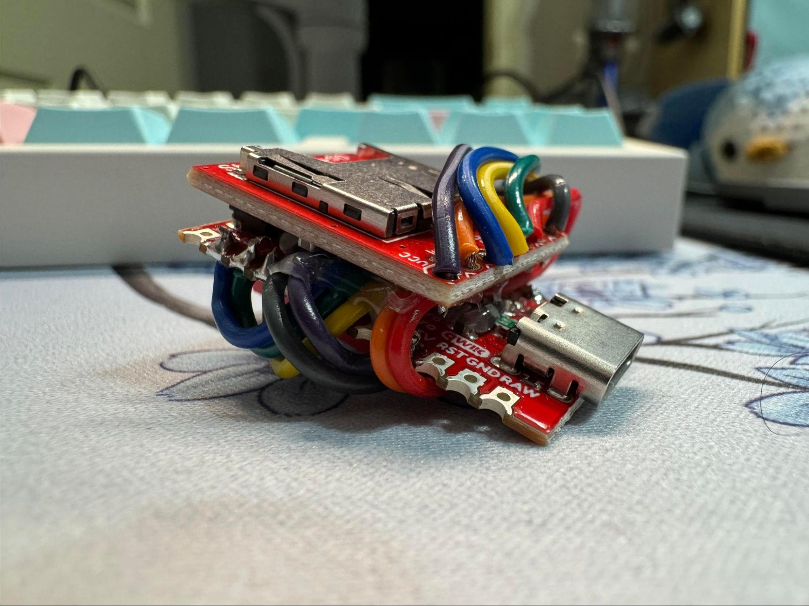

# Ardducky

Arduino-based "BadUSB" pentesting tool

## Overview

Ardducky is an Arduino-based “bad USB” penetration testing tool, which exploits computers’ inherit trust of USB HID (human interface devices, such as keyboards and mice) and uses them to send hundreds of keystrokes a second upon connection to a target PC to quickly and covertly install software tools, such as keyloggers, remote access tooling, and many other hacking software.

This tool is designed to be compatible and work with DuckyScript 1.0 payloads made for the original USB rubber ducky bad USB developed by Hak5 in 2011. This means that battle-tested payloads that are already shared by members of the pen-testing community can be used without modification.

This tool differs from the Hak5 implementations, as it allows users to put raw DuckyScript on text files on a microSD card without any compilation, as the file is interpreted on-device, allowing for quick payload creation and modification in the field. Furthermore, The device can have up to 64 payloads ready on the microSD card at once, selectable through the 6 DIP switches on the back of the device.
